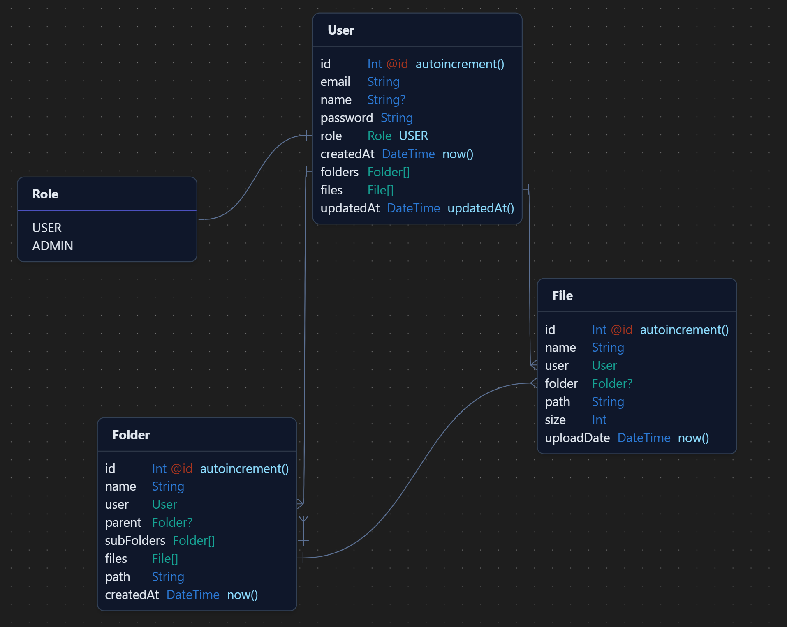

# File Manager on the Cloud

Efficient file management with a secure and scalable Node.js application using Express.js, Typescript PostgreSQL, and AWS S3.

## Database Schema




> ## Installation & Running Locally

```sh

# Install Dependencies
$ yarn install

# Rename .env.example to .env 
# Fill in the Credentials

# Run PostgreSQL DB on Docker
$ yarn docker:db

# Run the Application
$ yarn dev

# Testing
  Import the FileManager.postman_collection inside POSTMAN
  Register The User
  Login
  Copy the access_token from the response
  When making calls to the API endpoints, use the copied access_token as a Bearer Token.

```

> ## Techstack
- Express.js
- Typescript
- PostgreSQL
- Prisma (ORM)
- Docker
- yarn
- AWS S3 SDK V3
- Docker Compose

 ### API Testing Platform
- Postman

> ## Features
- User Registration & Login
- Create Folder
- Create Subfolder
- Upload Files
- Manage File (move,rename,delete)

> # API Endpoints

## User Management

1. **Register User**
   - **Endpoint:** `POST /v1/auth/register`
   - **Authorization:** None

2. **Login User**
   - **Endpoint:** `POST /v1/auth/login`
   - **Authorization:** None

## Folder Management

3. **Create Folder**
   - **Endpoint:** `POST /v1/folders`
   - **Authorization:** Bearer Token (`{{AUTH_TOKEN}}`)

4. **Create Subfolder**
   - **Endpoint:** `POST /v1/folders/:parentId`
   - **Authorization:** Bearer Token (`{{AUTH_TOKEN}}`)
   - **URL Parameters:**
     - `parentId`: ID of the parent folder

## File Management

5. **Upload File**
   - **Endpoint:** `POST /v1/files`
   - **Authorization:** Bearer Token (`{{AUTH_TOKEN}}`)
   - **Request Body:**
     - Form Data:
       - `file`: File upload
       - `folderId`: ID of the target folder

6. **Delete File**
   - **Endpoint:** `DELETE /v1/files/:fileId`
   - **Authorization:** Bearer Token (`{{AUTH_TOKEN}}`)
   - **URL Parameters:**
     - `fileId`: ID of the file to delete

7. **Rename File**
   - **Endpoint:** `PATCH /v1/files/:fileId/rename`
   - **Authorization:** Bearer Token (`{{AUTH_TOKEN}}`)
   - **Request Body:**
     - `newName`: New name for the file
   - **URL Parameters:**
     - `fileId`: ID of the file to rename

8. **Move File**
   - **Endpoint:** `PATCH /v1/files/:fileId/move/:destinationId`
   - **Authorization:** Bearer Token (`{{AUTH_TOKEN}}`)
   - **URL Parameters:**
     - `fileId`: ID of the file to move
     - `destinationId`: ID of the destination folder


> ## Design Strategy

1. **Technology Stack:**
   - Chose Node.js and Express.js for scalable, non-blocking I/O in server-side development.
   - Utilized PostgreSQL for relational database needs.
   - Integrated AWS S3 bucket for secure and scalable file storage.
   - Typescript for static type checking & smooth development

2. **User Authentication and Authorization:**
   - Implemented JWT & Passport for secure user authentication.
   - Integrated authorization checks for API endpoint permissions.
   - RBAC [user , admin]

3. **Code Structure:**
   - Seperating Code into Routes, Controllers, Services , middleware etc.

4. **Error Handling and Validation:**
   - Implemented robust error handling for API endpoints.
   - Data Validation using joi

5. **API Endpoints:**
   - Ensured simplicity and consistency in API design.

6. **File Handling**
   - Multer File Upload & Stream Based Upload to AWS S3


